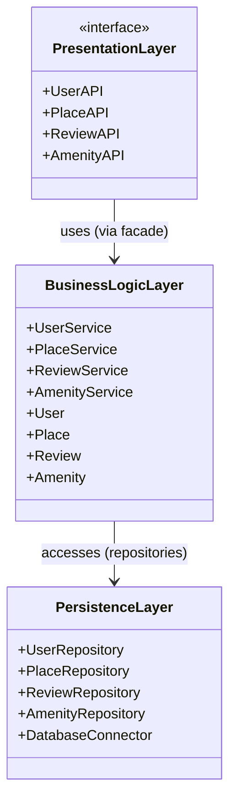
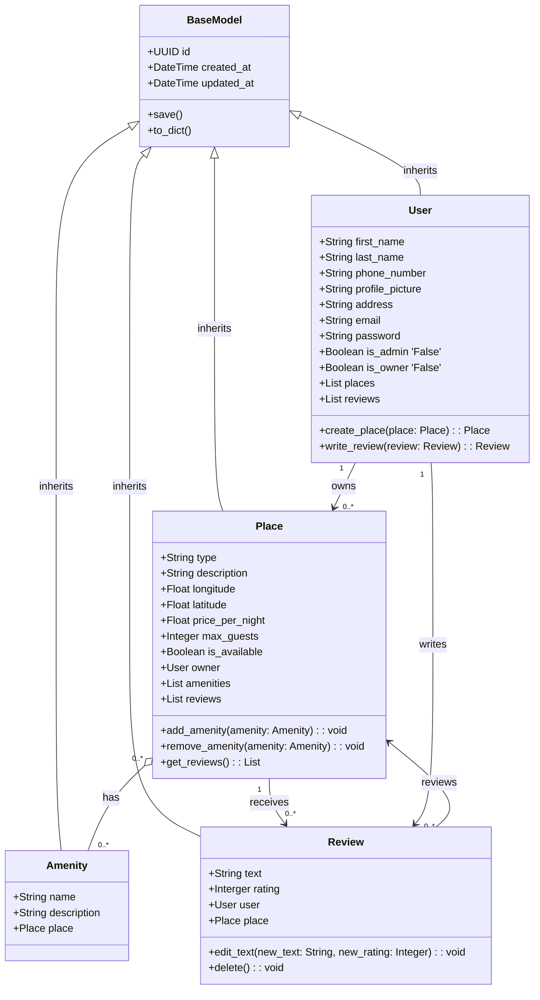
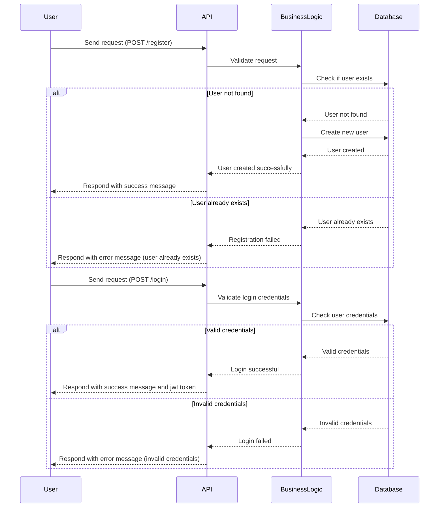
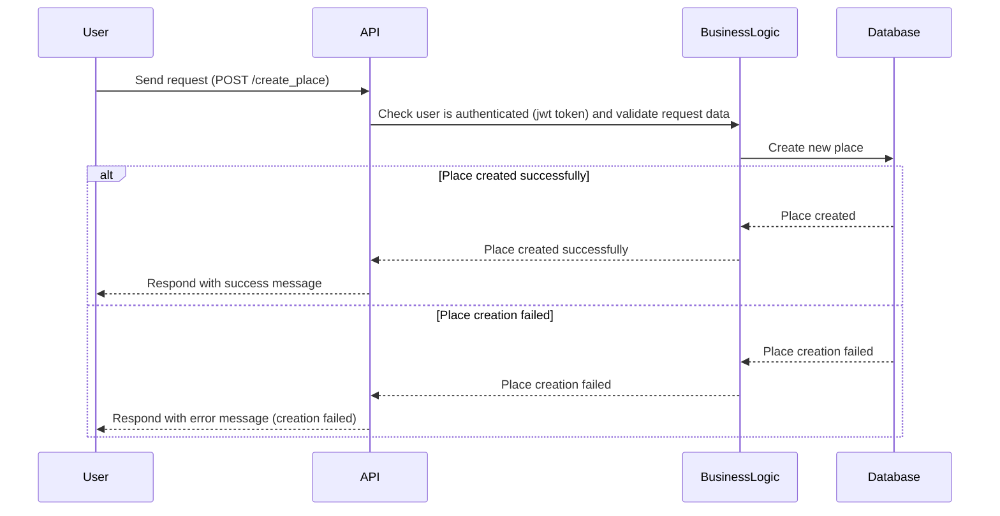
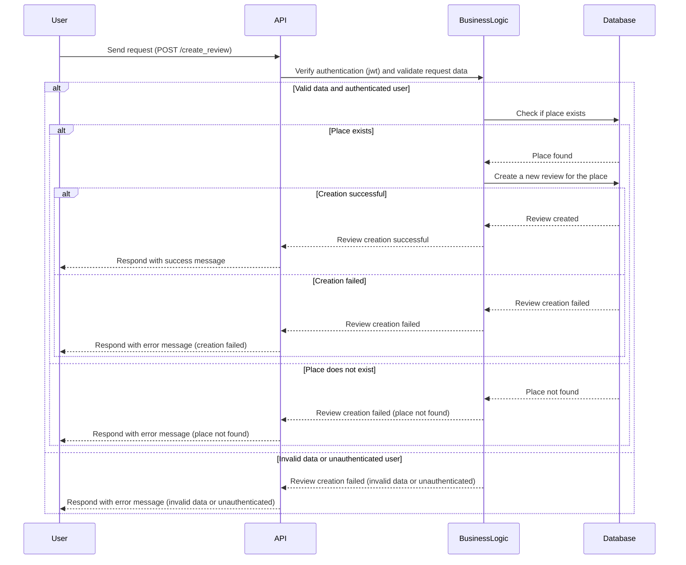
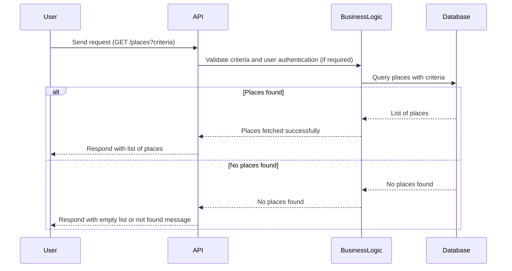

# HBnB UML

## Introduction

The HBnB project is a web-based application inspired by platforms like Airbnb, enabling users to register, create listings for places, submit reviews, and search for available accommodations. This technical documentation compiles the architectural and design diagrams developed in the initial planning phases, providing a comprehensive blueprint to guide the development of the HBnB system.

## HBnB Evolution - Technical Documentation

## 1. Overview

This document provides a technical overview of the HBnB Evolution project. It includes UML diagrams and explanations covering the architecture, class structures, and the main user flows of the application.

The application is built in layers:

* **Presentation Layer**: Handles HTTP requests (e.g., Flask REST API).
* **Business Logic Layer**: Core logic, user authentication, data validation.
* **Persistence Layer**: Interacts with the database (CRUD operations).

## 2. UML Diagrams

### 2.1 Layered Architecture (Package Diagram)

### 2.2 Class Diagram

## 3. API Interaction Flow

### Sequence Diagrams Overview

This section provides sequence diagrams for five core user flows through the HBnB API. These illustrate how client requests are handled by the API layer, passed through the business logic layer, and interact with the persistence layer.

### 1. User Registration and Login

### 2. Place Creation

### 3. Review Submission

### 4. Place Search by Criteria

### Explanation

These diagrams highlight how the application logic is separated into layers:

* **API Layer** validates the request and delegates to the business logic.
* **Business Logic Layer** checks business rules, user permissions, and request validity.
* **Persistence Layer** performs database operations and returns results.

JWT authentication and request validation are integrated at multiple levels to ensure security and robustness of operations.

## Conclusion

This technical documentation presents a thorough blueprint of the HBnB project’s structure and behavior. From a layered architectural perspective to detailed class responsibilities and dynamic API interactions, the documentation captures how the system is built for scalability, modularity, and maintainability. These diagrams and descriptions will serve as a continuous reference throughout the software development lifecycle, promoting consistency and clarity in implementation and future extension.

